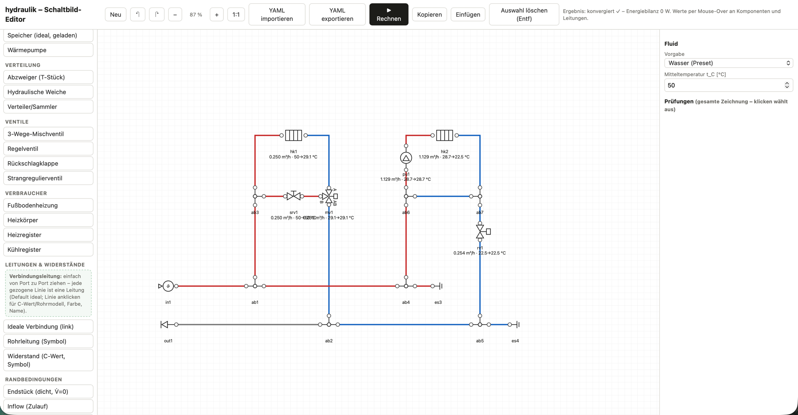

# hydraulik

Stationäre hydraulisch-thermische Berechnung von HVAC-Hydraulikschaltungen
(Heizung/Kühlung) als generisches 1D-Netzwerk. Inkompressibles Fluid mit
konstanten Stoffwerten (ρ, μ, cp); SIMPLE-artiger Druckkorrektur-Solver plus
sequentiell gelöste Energiegleichung — mit grafischem Schaltbild-Editor
inklusive integriertem Solver (Rechnen direkt im GUI, Ergebnisse per
Mouse-Over in der Zeichnung):



**Maschinenlesbare Strangschemas für KI-Agenten:** Strangschemas sind für
KI-Agenten bislang schwer zugänglich, weil ihre Vision-Fähigkeiten für das
zuverlässige Interpretieren von Anlagenschemata nicht ausreichen. Dieses Tool
löst das Eingabeproblem konstruktiv: Das Schema wird im Editor gezeichnet und
liegt damit von Anfang an **maschinenlesbar als YAML** vor — die Zeichnung
*ist* das Modell, es gibt keinen Interpretationsschritt. Über den integrierten
Solver (▶ Rechnen) wird die Eingabe **per Human in the Loop geprüft**
(Volumenströme, Drücke, Temperaturen direkt im Schema), bevor ein KI-Agent
das validierte YAML für Analyse- und Optimierungsstudien übernimmt. Das Paket
dient zugleich der Entwicklung von Benchmark-Tests für KI-Agenten in der
technischen Gebäudeausrüstung.

## Installation

```bash
git clone https://github.com/AI4Buildings/HVAC-Hydronic-Network-Solver.git
cd HVAC-Hydronic-Network-Solver
pip install -e ".[dev]"
pytest            # 135 Tests (analytische Referenzen + Validierung gegen Musterlösungen)
```

Danach steht das CLI `hydraulik` zur Verfügung (`run`, `editor`, `serve`).

## Schnellstart

```bash
hydraulik run examples/04_heatpump_separator.yaml
```

oder in Python:

```python
import hydraulik as h

net = h.Network(fluid=h.water_at(45))
net.add(h.HeatPump("wp1", mode="target_t_out", t_out_set_C=45, q_max_kW=12, q_nom_m3h=1.4))
net.add(h.Pump("pu1", mode="constant_flow", q_m3h=1.4))
net.add(h.Radiator("hk1", q_nom_kW=7.5, t_sup_nom_C=45, t_ret_nom_C=40, t_room_C=21))
net.connect("wp1.out", "pu1.in")
net.connect("pu1.out", "hk1.in")
net.connect("hk1.out", "wp1.in")

result = net.solve()
print(result.report())
print(result["hk1"].q_dot_kW)      # Wärmestrom ins Wasser [kW]
```

## Schaltbild-Editor (grafische Eingabe, Human in the Loop)

```bash
hydraulik serve                                # Editor MIT Rechen-Endpunkt (empfohlen)
hydraulik editor --out hydraulik_editor.html   # nur Zeichnen (statische Datei)
```

**Workflow**: Schaltung zeichnen → **▶ Rechnen** direkt im GUI (lokaler
Endpunkt POST /solve, nur 127.0.0.1) → Ergebnisse erscheinen in der
Zeichnung: Werte­zeile unter jeder Komponente (V̇, T ein→aus) und
Mouse-Over-Tooltips (Komponenten: V̇, Δp, T, Q̇, v; Leitungen/Ports:
Knotendruck in kPa(ü) und Temperatur) → prüfen, korrigieren, neu rechnen
(jede Änderung verwirft die Ergebnisse automatisch) → YAML als Datei
exportieren → Analyse-/Optimierungsstudien mit dem Solver skripten (z.B.
durch einen Coding-Agenten — der das Anlagenschema dann nicht mehr aus
Abbildungen interpretieren muss, sondern das validierte YAML erhält).

Eigenständige HTML-Datei (kein Server, keine Internetverbindung): Komponenten
aus der Palette platzieren; **jede gezogene Linie ist eine
Verbindungsleitung** (`conduit`): standardmäßig ideal, per Inspector
wahlweise C-Wert, Auslegungspunkt (dp + q) oder Rohrmodell (length +
d_inner …, inkl. Wärmeverlust) — mit eigenem Namen (sichtbar bei
Selektion), `ts`-Label und eigenen Ergebniswerten im Hover (V̇, Δp, T, v).
**Leitungsführung mit Knickpunkten** (Doppelklick auf Leitung setzt eine
Umlenkung, Griffe ziehen, Doppelklick auf Griff entfernt; ohne Knick
automatisch gerade bzw. abgewinkelt), **Vorlagen für Standardschaltungen**
(Palette-Register „Vorlagen“: mitgeliefert sind die sieben Grundschaltungen
Beimischschaltung einfach/doppelt/doppelt-differenzdruckarm, Drossel-,
Umlenk- sowie Einspritzschaltung mit Durchgangs- bzw. Dreiwegeventil;
eigene Vorlagen: Bereich auswählen → „Als Vorlage speichern" → per Klick
platzieren und Parameter anpassen; im Browser gespeichert, als JSON-Datei
export-/importierbar zum Teilen), **Mehrfachauswahl**
(Auswahlrechteck aufziehen oder Shift+Klick) mit gemeinsamem Verschieben und
**Kopieren/Einfügen ganzer Teilschaltungen** (Strg+C/V/D — interne Leitungen
werden mitkopiert, Namen automatisch hochgezählt), **Undo/Redo**
(Strg+Z / Strg+Shift+Z oder ↶/↷), **Zoom** (Strg+Mausrad an der
Cursorposition oder −/+/1:1-Buttons, 25–300 %, Zeichenfläche 4000×2600),
**Drehen in 90°-Schritten** (Taste `r` —
Ports rotieren mit), Parameter im Inspector (mit Einheitenwahl und
Bereichsanzeige), Leitungsfarben Heizung (VL rot / RL blau) und **Kälte
(VL hellgrün / RL dunkelgrün)**, `ts`-Labels, Live-Prüfliste (unverbundene
Ports, fehlende Pflichtparameter, Wertebereiche; klicken wählt die
betroffene Komponente aus). **Export erzeugt direkt
rechenbares YAML** inkl. `layout:`-Block (Zeichnungskoordinaten) für den
Re-Import — die Zeichnung ist damit das Modell, es gibt keinen
Interpretationsschritt. Palette, Ports und Formulare werden aus der
Komponenten-Registry generiert (Single Source of Truth): Nach neuen
Komponenten einfach den Editor neu erzeugen.

## YAML-Eingabeformat (KI-/LLM-freundlich)

```yaml
fluid: {preset: water, t_C: 45}      # oder {rho: 998, mu: 1.0e-3, cp: 4180}
settings: {max_iter: 400}            # optional (siehe SolverSettings)

components:
  wp1:  {type: heat_pump, mode: target_t_out, t_out_set_C: 45, q_max_kW: 12, q_nom_m3h: 1.4}
  pu1:  {type: pump, mode: constant_flow, q_m3h: 1.4}
  hk1:  {type: radiator, q_nom_kW: 7.5, t_sup_nom_C: 45, t_ret_nom_C: 40, t_room_C: 21}

connections:                          # 'komponente.port'; ≥3 Einträge = Verzweigung
  - [wp1.out, pu1.in]
  - [pu1.out, hk1.in]
  - [hk1.out, wp1.in]
```

Regeln:
- **Einheiten über Suffixe**: `dp_kPa`/`dp_Pa`/`dp_bar`, `q_m3h`/`q_l_s`/`q_m3s`,
  `t_..._C`, `..._kW`/`..._W`, `length_m`/`..._mm`, `kvs_m3h`, `ua_W_K`,
  `u_linear_W_mK`, `k_W_m2K`, `m_dot_air_kg_s`. Intern strikt SI.
- Jeder Port muss in mindestens einer Verbindung vorkommen. Ein Port in
  mehreren Verbindungen (oder ≥3 Ports je Eintrag) bildet eine ideale
  Mischstelle (Verzweigung).
- Validierungsfehler werden **gesammelt** als nummerierte Liste gemeldet
  (mit Korrekturvorschlägen), sodass eine Datei in einem Durchgang korrigierbar ist.


## Lüftungsschema-Editor (VKA nach EN 16798-5-1)

Zweites GUI unter `hydraulik serve` → **http://127.0.0.1:8091/lueftung** (Hydraulik: `/hydraulik`; die Startseite `/` verlinkt beide):
Lüftungsanlagen als zwei Ketten zeichnen (Zuluft: AUL → … → ZUL oben,
Abluft: ABL → … → FOL unten; die WRG verbindet beide Stränge) und mit dem
integrierten VKA-Rechenkern (energieoptimale Regelung, aus dem Skill
vka-effizienz-en16798) rechnen. Komponenten: WRG (Sorptions-/Enthalpie-/
Kondensationsrotor, KVS, Platte), Frostschutz, Vor-/Nachheizer, Kühler,
Befeuchter (Dampf/Sprüh), Ventilatoren (SFP), Umluft, Filter, Schalldämpfer
und Luft-Sensoren (Kombifühler T+rF, T, rF, Δp, p, V̇, Energiezähler,
Stromzähler — als Anzapfungen mit dünner Messleitung an beliebige
Kanal-Anschlüsse, ohne die Stränge zu berühren; alle mit BEMS-Messpunktlisten).
Nach dem Rechnen zeigen Mouseover-Tooltips auf jeder Kanalleitung den
Luftzustand des Abschnitts (ϑ, φ, x, V̇); Fühler zeigen den Zustand an
ihrer Messstelle. Regelungsart an der Zuluft wählbar:
Zustand **fest** gepinnt, **Sollband** oder **raumgekoppelt** mit
Feuchtelast (simulate_room). Ergebnisse (Heiz-/Kühl-/Befeuchterleistung,
WRG-Kennwerte, Zuluftzustand, Ventilatorstrom) erscheinen im Ergebnispanel,
als Tooltip und unter jeder Komponente; zwei Vorlagen (Vollklima mit
Sorptionsrotor, KVS-Anlage) liegen bei. Die Ventilatorposition wird
rechnerisch am Stranganfang bilanziert (validierte Modellkonvention).

## Sensoren & BEMS-Integration (Betriebsdatenanalyse)

Das maschinenlesbare Strangschema ist nicht nur Rechenmodell, sondern auch
semantische Karte für die Betriebsdatenanalyse eines Building Energy Management
Systems (BEMS, z.B. Aedifion). Die Palette-Rubrik **SENSOREN** (unterste Gruppe im Register „Komponenten“) stellt dafür
Temperatur-, Druck-, Differenzdruck-, Volumenstromsensoren und Wärmemengenzähler
bereit:

- **Rückwirkungsfrei:** Fühler zapfen den Messknoten nur an (Messleitung =
  dünne Linie, reine Knotenverschmelzung, keine Rohrleitung); V̇-Sensor und WMZ
  sitzen quasi-ideal in der Leitung. Die Hydraulik bleibt unverändert.
- **Mitwachsende Zeichenfläche:** das Canvas vergrößert sich automatisch,
  sobald Komponenten oder Knickpunkte an den Rand rücken (immer ~600 px
  Reserve hinter dem äußersten Element) — beliebig große Strangschemas ohne
  Einstellungen; beim Löschen schrumpft es auf die Standardgröße zurück.
- **Strömungsrichtung im Bild:** nach erfolgreicher Rechnung zeigt jede
  Verbindungsleitung in ihrer Mitte ein schlankes Richtungsdreieck in
  Linienfarbe (V̇ ≈ 0 oder zu kurze Stücke bleiben pfeilfrei; bei jeder
  Änderung verschwinden die Pfeile mit dem Ergebnis).
- **Messwerte per Mouseover:** nach dem Rechnen zeigt der Tooltip die simulierten
  Sensorwerte (ϑ, p, Δp, V̇, WMZ zusätzlich Q̇ aus ṁ·cp·Δϑ) samt BEMS-Zuordnung;
  im Python-Ergebnis stehen sie unter `result.sensors` bzw. `to_dict()["sensors"]`.
- **BEMS-Datenpunkte (generisch):** JEDE Komponente trägt eine frei lange
  Messpunktliste `bems: [{id, key, description}, …]` — `id` ist die abfragbare
  Datenpunkt-ID, `key` der sprechende Alias (z.B. `EXP_HP_SEK_T_VL`),
  `description` die Semantik. So bildet ein WMZ seine fünf realen Datenpunkte
  (V̇, Q̇, Q_kum, ϑ_VL, ϑ_RL) ab, ein Speicher mehrere Fühler, ein Stellventil
  sein Stellsignal, eine Pumpe Cmd + kWh-Zähler. Zusätzlich hat jede Komponente
  ein freies `description`-Feld. Im Editor sind die Eingaben in zwei Register
  getrennt: **Fluid-Info** (Simulationsparameter) und **BEMS-Info**
  (Beschreibung + Messpunkte, „+ Messpunkt hinzufügen").
- **Zweck:** Ein LLM, das die YAML-Datei liest, erhält damit beides zugleich —
  die Netzwerktopologie (wo sitzt der Sensor, was liegt strom­auf/-ab) und den
  Schlüssel zu den realen Zeitreihen. Simulation und Messdaten lassen sich so
  automatisiert verknüpfen (Soll-Ist-Vergleich, Performance-Gap-Analyse).

## Komponententypen

| `type` | Ports | Wichtigste Parameter |
|---|---|---|
| `pipe` | in, out | `length_m`, `d_inner_mm`, `roughness_mm`, `zeta`, `u_linear_W_mK`, `t_amb_C` |
| `flow_resistance` | in, out | `c_Pa_m3h2` (C-Wert, z.B. aus REGuA) oder `c_Pa_m3s2` oder Auslegungspunkt `dp_kPa` + `q_m3h`; optional `a_Pa_m3h` (linearer Anteil). Genau eine Widerstandsangabe. Dichteunabhängig (anders als Kv!) |
| `pump` | in, out | `mode: constant_dp\|constant_flow`, `dp_kPa` bzw. `q_m3h`, `q_nom_m3h` |
| `control_valve` | in, out | `kvs_m3h`, `opening` (0…1), `characteristic: equal_percentage\|linear` |
| `balancing_valve` | in, out | `kvs_m3h`, `opening` (Voreinstellung) |
| `ball_valve` | in, out | Kugelhahn (Absperrarmatur): Default offen und druckverlustfrei (1 Pa Referenzverlust bei `q_nom_m3h`, wie `link`); optional realer `kvs_m3h`; `closed: true` = Revisionsfall, sperrt exakt (V̇ = 0) |
| `temperature_sensor` | port | Temperaturfühler (Messstelle anzapfen, keine Kante): liest ϑ des Knotens |
| `pressure_sensor` | port | Drucksensor: liest p (Überdruck) des Knotens |
| `pressure_diff_sensor` | plus, minus | Differenzdrucksensor: Δp = p(plus) − p(minus), z.B. über Pumpe/Ventil |
| `flow_sensor` | in, out | Volumenstromsensor in der Leitung (quasi-ideal, 1 Pa bei `q_nom_m3h`) |
| `energy_meter` | in, out, t_ref | Wärmemengenzähler: Durchflussteil in der Leitung + Fühler `t_ref` in der Gegenleitung; misst V̇, beide ϑ und Q̇ = ṁ·cp·(ϑ_ref − ϑ_Leitung) (Einbau im RL → Q̇ > 0 = Kreisabgabe); die 5 realen Datenpunkte als `bems`-Einträge |
| `check_valve` | in, out | Rückschlagklappe: `kvs_m3h` (Durchlassrichtung in→out); sperrt rückwärts (Restleckage kvs/1000, über `block_factor` einstellbar) |
| `mixing_valve_3way` | a, b, ab | `kvs_m3h`, `opening` (A-Pfad), `characteristic` |
| `radiator` | in, out | `q_nom_kW`, `t_sup_nom_C`, `t_ret_nom_C`, `t_room_C`, `n`, `q_prescribed_kW`; Hydraulik: `kv_m3h` ODER `c_Pa_m3h2` (Default 10 kPa bei Nennstrom) |
| `floor_heating` | in, out | `area_m2`, `k_W_m2K`, `t_room_C`; Hydraulik: `length_m` (+ `d_inner_mm`, Rohrmodell) ODER `c_Pa_m3h2` |
| `heating_coil` / `cooling_coil` | in, out | ε-NTU mit Teillast-UA nach Gl. 4.2 (`ua_ref_W_K`, `n` Default 0.4, Referenzen `q_w_ref_m3h`/`m_dot_air_ref_kg_s`; ohne Referenzen UA konstant); `m_dot_air_kg_s`, `t_air_in_C`, `arrangement`; ODER feste Leistung `q_prescribed_kW` (dann kein UA nötig); Hydraulik: `kv_m3h` ODER `c_Pa_m3h2`. Kühlregister zusätzlich Greybox MIT Kondensation: `ua_star_wet_kg_s` + `rh_air_in` (0…1) → Q̇ = max(trocken, nass), Kondensatrate/Luftaustritt in extras |
| `heat_pump` / `chiller` | in, out | `mode: prescribed_q\|target_t_out`, `q_dot_kW` bzw. `t_out_set_C` + `q_max_kW`, `dp_nom_kPa`, `q_nom_m3h` |
| `buffer_storage` | p1…pN | `n_ports`, `ua_W_K`, `t_amb_C` (ideal durchmischt) |
| `inflow` (Zulauf) | port | `t_set_C` + ENTWEDER `q_m3h` (Zulauf-V̇) ODER `p_kPa` (Überdruck gauge) |
| `outflow` (Austritt) | port | ENTWEDER `p_kPa` (Überdruck gauge; Auslauf ins Freie: 0) ODER `q_m3h` (Entnahme-V̇); Austrittstemperatur ist Ergebnis |
| `ideal_storage` | in, out | `t_set_C` (Vorlauf fest; Rücklauf und Leistung sind Ergebnis); optional `q_m3h` (eingeprägter Volumenstrom, Δp ist Ergebnis) und/oder `p_out_kPa` (Überdruck am Austritt = Druckanker); `dp_nom_kPa` + `q_nom_m3h` |
| `conduit` (Verbindungsleitung) | in, out | universelle Leitung (im Editor als Linie): ohne Angabe ideal; `c_Pa_m3h2` ODER `dp_kPa`+`q_m3h` ODER Rohrmodell — ein Abschnitt via `length_m` (+ `d_inner_mm`, …) ODER beliebig viele Abschnitte in Reihe via `pipes: [{length_m, d_inner_mm, roughness_mm, zeta}, …]` (im Editor: Abschnittsliste mit +/−); Wärmeverlust `u_linear_W_mK`/`t_amb_C` über die Gesamtlänge |
| `link` | in, out | `q_nom_m3h`. Widerstandsfreie Verbindung (Δp ≈ 1 Pa), die zwei Knoten **thermisch trennt** — für Anschlüsse entlang eines Sammlers, damit Zapfstellen nicht stromab eingemischtes Wasser „sehen" |
| `hydraulic_separator` | prim_in, prim_out, sec_in, sec_out | `q_nom_m3h`, `dp_nom_Pa`, `ua_W_K` |
| `manifold` | main, s1…sN | `n_ports` |
| `tee` | a, b, c | T-Stück 90° (a–b gerader Strang, c Abzweig): Default idealer Knoten; mit `d_run_mm` + `d_branch_mm` Druckverlust nach Idelchik (Diagramme 7-10/7-21, ζ = f(V̇-Verhältnis, Flächenverhältnis), Vereinigung UND Trennung automatisch aus der Strömungsrichtung, inkl. Bernoulli-Umrechnung auf statische Drücke) |
| `open_end` | port | `bc: pressure\|flow`, `p_kPa` bzw. `q_m3h`, `t_supply_C` |
| `cap` | port | dichtes Endstück (Blindstopfen): V̇ = 0 — zum Verschließen von Anschlüssen bei Teilbereichstests; keine Parameter |

Alle wärmeübertragenden Komponenten akzeptieren `q_prescribed_kW`
(feste Leistung statt physikalischem Modell). Kühlregister v1: nur
trockener Betrieb (sensibel, ohne Entfeuchtung).

**Teilstrecken-Gruppierung:** Jede Komponente kann ein Label `ts: <nummer>`
tragen (YAML wie Python-API). Der Bericht enthält dann eine Teilstrecken-
Tabelle, die je Gruppe die Kette(n) in Strömungsrichtung auswertet: V̇, ΣΔp
sowie p und T an Anfang und Ende jedes Abschnitts (eine klassische TS mit
Vor- + Rücklauf unter einer Nummer zerfällt in zwei Abschnitte). Konsistenz
wird geprüft: uneinheitliche Volumenströme oder Verzweigungen innerhalb einer
Gruppe (= Teilstrecke falsch geschnitten) erzeugen einen Hinweis.

**Modellierungsrichtlinie — Teilstrecken-Widerstände aufteilen:** C-Werte aus
Handrechnungen enthalten meist Vor- UND Rücklauf. Empfohlen ist die hälftige
Aufteilung (C/2 als eigene `flow_resistance` je Richtung — die Leitungen sind
in der Praxis parallel und gleich lang verlegt): Für die Kreisvolumenströme
ist das äquivalent zum konzentrierten Wert, liefert aber korrekte Druckniveaus
an allen Knoten, und die Rücklaufäste sind eigene Kanten — die thermische
Mischreihenfolge an Sammlern stimmt dann von selbst. Konzentriert man dagegen
alles in den Vorlauf, verschmelzen widerstandsfreie Rücklaufanschlüsse zu
EINEM Mischknoten (Zapfstellen „sehen" stromab eingemischtes Wasser); dann
Knoten mit `link` trennen. Beispiel: `examples/07_twe_heizkreisverteiler.py`.

Ventile: `opening: 0` (bzw. die Endlagen des 3-Wege-Ventils) sperrt
**exakt** — die Kante wird zur Randbedingung V̇ = 0, der abgesperrte
Netzteil erhält automatisch einen Referenzdruck. Im Regelbereich
(0 < opening < 1) begrenzt das Stellverhältnis (`rangeability`) den
kleinsten Kv auf Kvs/R.

## Randbedingungen

- **Pumpen**: konstante Druckdifferenz (`constant_dp`) oder konstanter
  Volumenstrom (`constant_flow`, Druckerhöhung ist dann Ergebnis).
- **Offene Rohrenden** (`open_end`): Druck ODER Volumenstrom vorgebbar,
  plus Zulauftemperatur.
- **Alle Drücke sind Überdrücke (gauge).** Bei inkompressiblem Fluid ohne
  Verdampfung/Kondensation ist nur das Druckniveau relativ zur Atmosphäre
  relevant; Randbedingungen und Ergebnisse sind einheitlich als Überdruck zu
  lesen (Auslauf ins Freie: `p_kPa: 0`).
- **Geschlossene Kreise** ohne Druckvorgabe erhalten automatisch einen
  Referenzdruck (150 kPa(ü) ≈ typischer Anlagenfülldruck, einstellbar über
  `p_ref`) – nur Druckdifferenzen sind dann physikalisch relevant; ein
  Hinweis erscheint im Bericht. Alternativ verankert eine Quelle mit `p_out`
  das Niveau explizit (wie ein Ausdehnungsgefäß am Erzeuger).
- **Inflow/Outflow** (je ein Anschlusspunkt): Zulauf mit Temperatur +
  (V̇ ODER Überdruck); Austritt mit (Überdruck ODER Entnahme-V̇), die
  Austrittstemperatur ist Ergebnis — die Randbedingungen offener Systeme.
  **Speicher** (`ideal_storage`, Zweitor für geschlossene Kreise):
  Vorlauftemperatur fest, Rücklauf/Leistung Ergebnis; optional eingeprägter
  Volumenstrom und/oder Druckanker `p_out`.
- **Rein hydraulische Rechnung**: `net.solve(thermal=False)` überspringt die
  Energiegleichung — nützlich für Kennlinienstudien und für Fälle ohne
  stationäre Temperaturlösung (z.B. thermisch isolierter Umlauf mit fest
  vorgegebener Leistung; wird sonst erkannt und verständlich gemeldet).

## Numerik

- **Hydraulik**: SIMPLE-artige Druckkorrektur auf dem Netzgraphen. Knoten
  tragen p und T, Komponenten sind Kanten mit Δp = a·Q + b·Q·|Q| − Δp_Quelle.
  Der Impulsprädiktor in Newton-Inkrementform und die Druckkorrektur
  K = A·diag(1/J)·Aᵀ (J = a + 2b|Q|) machen den Schritt bei α = 1 zu einem
  exakten Newton-Schritt (Schur-Komplement) → typisch 3–6 Iterationen.
  Robustheit: Churchill-Reibungskorrelation (glatt über alle Re-Bereiche),
  Widerstands-Floor für Q → 0, Kv-Leckage-Floor für fast geschlossene Ventile,
  Divergenz-Wächter mit automatischer Relaxationshalbierung, Jacobi-Skalierung.
  Kompilierzeit-Checks: Druckinsel-Analyse, Bilanz fester Volumenströme.
- **Thermik**: nach Hydraulik-Konvergenz Upwind-Advektion mit
  Gauss-Seidel-Sweeps; ideale Mischung an Knoten, UA-Verluste, Heizkörper-
  Exponentenmodell (Brent-Verfahren), ε-NTU-Register, exponentielle
  Rohr-/FBH-Modelle. Globale Energiebilanz wird geprüft und im Bericht
  ausgewiesen. Strömungsumkehr ist zulässig (Upwind folgt dem Vorzeichen).
  Robustheit: Periode-2-Grenzzyklen (z.B. durch q_max-Klemmen) werden
  erkannt und adaptiv gedämpft; thermisch isolierte Umläufe mit fester
  Leistung (keine stationäre Lösung) werden als Drift erkannt und mit
  Abhilfevorschlägen gemeldet.

## Beispiele

| Datei | Inhalt |
|---|---|
| `examples/01_single_loop.yaml` | WP + Pumpe + Heizkörper (Einzelkreis) |
| `examples/02_parallel_radiators.yaml` | 3 parallele HK-Stränge mit Strangregulierventilen |
| `examples/03_mixed_floorheating.yaml` | Beimischschaltung (3-Wege-Ventil) für FBH |
| `examples/04_heatpump_separator.yaml` | WP + hydraulische Weiche + HK-Kreis + FBH-Beimischkreis |
| `examples/05_umlenk_einspritz.yaml` | Umlenk- + Einspritzschaltung, Teilstrecken als Kvs-Äquivalente |
| `examples/06_umlenk_einspritz_flow_resistance.yaml` | wie 05, Teilstrecken direkt als C-Werte (REGuA) |
| `examples/07_twe_heizkreisverteiler.py` | TWE (Durchlaufprinzip) + Verteiler mit Einspritz-Regelgruppen: Auslegung (RG-Ventil, SRVs, Pumpen) + Solver-Verifikation + Abschaltfall; TS-Labels, hälftige Widerstandsaufteilung |

Validierung gegen unabhängige Referenzlösungen (FH-Burgenland-Übungen):

| Datei | Inhalt |
|---|---|
| `examples/validation_fh_verteiler.py` | Kennlinien-Plots (Ventilhub-Sweeps) zu Bsp 05/06 mit Referenzankern aus den Lösungsplots |
| `examples/08_ventilautoritaet.py` | Wirkung der Ventilautorität: installierte Kennlinien (linear/gleichprozentig) für a_V = 0.1…0.9 |
| `examples/09_energetikum_lueftungsregister.yaml` + `.py` | Reale Anlage (Energetikum-Lüftung): VE/NE-Register als Einspritzschaltung mit Durchgangsventil im Rücklauf, echte Aedifion-BEMS-IDs; Analyse: Datenblatt-Reproduktion, Einregulierung (STAD-Voreinstellung), Ventilautorität |
| `examples/referenzwerte_fh_verteiler.txt` | alle aus dem Lösungs-PDF extrahierten Referenzwerte (exakt vs. abgelesen) |
| `tests/test_validation_fh_verteiler.py` | Volllast-Volumenströme < 0.1 %, Ventilautoritäten, Kennlinien-Anker |

```bash
python3 examples/run_examples.py     # alle YAML-Beispiele mit Bericht
hydraulik run <datei.yaml> --json    # maschinenlesbares Ergebnis
```

## Entwicklerdokumentation

| Datei | Inhalt |
|---|---|
| `CLAUDE.md` | Projektleitfaden: Befehle, Struktur, Konventionen |
| `docs/architektur.md` | Graphmodell, Solver-Verträge, Kompilierung, Parametersystem |
| `docs/numerik.md` | Herleitung des Solvers (SIMPLE ≡ Newton via Schur-Komplement), Robustheitsmaßnahmen, Thermik, Testabdeckung |
| `docs/erweitern.md` | Anleitung: neue Komponenten hinzufügen (mit Codegerüst) |
| `docs/roadmap.md` | Stand, bewusste v1-Grenzen, v2-Ideen, Wiedereinstieg |
